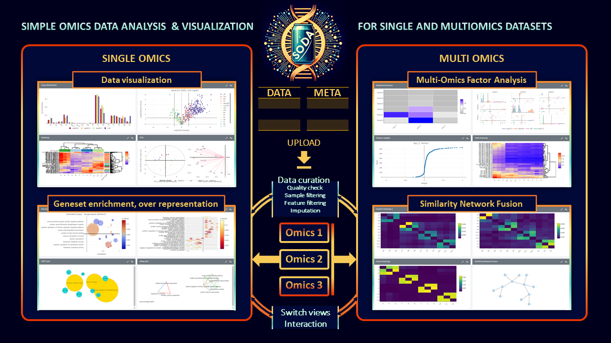

# SODA: Simple Omics Data Analysis


SODA, the Simple Omics Data Analysis tool, is a comprehensive online platform designed for the intuitive and in-depth analysis of both single and multi-omics experiments. Central to its design philosophy are modularity, interactivity, and an emphasis on user-driven exploration. Upon uploading their omics datasets, users can delve into a suite of single omics modules that offer capabilities ranging from data visualization to gene set enrichment and over-representation analysis. Each module is equipped with highly interactive plots, ensuring an optimized data exploration experience. For integrated insights from multi-omics experiments, SODA incorporates the acclaimed MOFA (Multi-Omics Factor Analysis) and SNF (Similarity Network Fusion) methodologies, presenting results through equally interactive visualizations. A standout feature of SODA is its modular architecture, which not only ensures current robustness in analysis but also paves the way for future expansions



## Features

- **Single omics**: SODA is as much single omics as it is multi-omics! Import, curate, filter, impute and process your single omics data to ultimately visualize results.
- **Support for Multiple Omics Types**: Currently supports lipidomics, proteomics, transcriptomics, and genomics data.
- **Modular Design**: Upload each single omics experiment into its dedicated module. This allows for independent analysis of multiple single omics experiments. Furthermore, SODA's modular nature encourages user contributions by making it easier to add functionalities.
- **Interactive Plots**: Each plot in SODA is made interactable to enhance data exploration and stimulate investigations across modules.
- **Multi-Omics Analysis**: Integrated MOFA (Multi-Omics Factor Analysis) and SNF (Similarity Network Fusion) modules can combine multiple single omics modules, offering deeper insights into the underlying drivers of variations across omics types.


## Getting Started

You can access SODA online or download it for local usage:

- **Online Version**: [SODA Web Platform](http://h2983352.stratoserver.net/)
- **Download & Setup**: Grab the latest release from this GitHub repository and follow the installation instructions below.

## Installation

Clone the repository:
   ```bash
   git clone https://github.com/ndcn/soda-ndcn.git
   ```

## Documentation

Detailed documentation can be found in ./man (coming soon).

## Demo & Examples

Coming soon.
