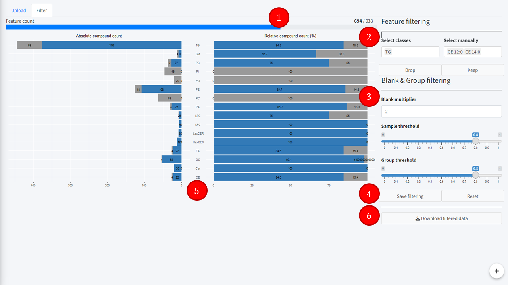

Lipidomics filter tab
=======================
---
<details>
<summary><b> Filtering </b></summary>

Tab to filter out features and keep only the significant ones.  
1. **Feature count**  
Features remaining in the *Lipidomics filtered table* after filtering.  
2. **Feature filtering**  
Select either lipid classes or lipid compounds individually, and then choose either to drop them (remove them) or to keep them (remove everything else).  
3. **Blank and Group filtering**  
This is used to remove features that are not significantly above blank. For more details, see the Data processing section below.  
- Blank multiplier: for a given feature, number of times above the blank mean each sample must be to be considered a significative value.  
- Sample threshold: for a given feautre, ratio of the total amount of samples that must be above the blank values x blank multiplier for that feature to be kept.  
- Group threshold: secondary threshold for the main groups of interest. Works like "Sample threshold" but instead of being in proportion to the total amount of samples, it will be in proportion to the number of samples in each group.  
4. **Save or Reset buttons**  
- The save button saves the filtering to the *Lipidomics filtered table*  
- The reset button reverts the *Lipidomics filtered table* to its original imported state.  
5. **Class preview plots**  
Two bar plots displaying the absolute and relative compound count per lipid class. The first one is absolute count, with the total compounds in each class and the remaining count after filtering. The second one is the relative count, displaying the percentage of compounds remaining in each class after filtering.  
6. **Download filtered data button**  
Downloads the *Lipidomics filtered table* as a CSV file.  



</details>


<details>
<summary><b> Data processing </b></summary>

**Blank and Group filtering**.  
Removes features that are not significantly above blanks. It is applied using the following method:  
```
Omics_data$feature_filter(blank_multiplier, sample_threshold, group_threshold)
```
This method updates the *Filtered data table* (created at import) by removing non-significant features. It uses itself two functions: blank_filter and group_filter.  
1. **blank_filter**.  
Takes as input the initial *Filtered data table*, the *Blank table*, blank_multiplier, and sample_threshold. This function returns a list of features that will be set for deletion (del_cols).  
Missing values from the *Filtered data table* are imputed by 0. Feature means are calculated from the *Blank table*. Features with only missing values will have their mean set to 0. These means multiplied by the blank_multiplier will constitute the threshold. For each feature, the ratio of samples above threshold is calculated and if that ratio is strictly below the sample_threshold, the feature is set for deletion.  
2. **group_filter**.  
Takes as input the initial *Filtered data table*, the *Blank table*, the *Filtered metadata table*, del_cols (see above), the group column name, the blank_multiplier and the group_threshold. It returns a list of columns to be saved from deletion from inside del_cols (saved_cols).  
Missing values in the *Filtered data table* are ignored (same as 0 imputation). Feature means are calculated from the *Blank table* as before, missing values being set to 0 and all means multiplied by the blank_multiplier to constitute the threshold. This time, the ratio of samples is calculated for each sample group and if any of the groups has a ratio above or equal to the group_threshold, the feature is saved from deletion.  
  
The saved_cols are then removed from the del_cols and the remaining del_cols are removed from the *Filtered data table*.  
</details>

