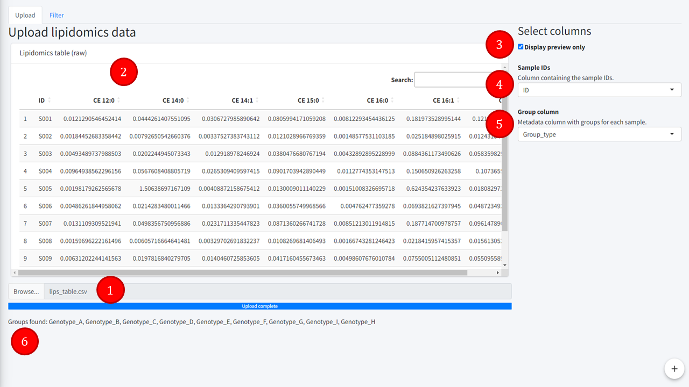

Lipidomics upload tab
=======================
---

Tab to upload the lipidomics data and identify some key columns.

1. **Upload module**  
Search the file to be uploaded, which must be formatted as displayed in the *Table format* help tab.  
2. **Uploaded table**  
Preview or the full table uploaded. 
3. **Preview table**  
Whether the imported table should be displayed entirely or only a preview. For lipidomics data, a preview is displayed by default to speed up the upload.  
4. **Sample IDs**  
Select the ID column of the lipidomics table, shared between all uploaded tables. Must be unique, string or integer.  
5. **Group column**  
Select the group column, which will contain the default groups for the lipidomics data visualisation (this can be changed later) and more importantly, the groups for the *Blank and Group filtering*. It is a column from the *Metadata table*. Note that this should always be the main group studied as it is used in the blank filtering. When going back and forth between visualisation and filtering, it is important to also change the group column to be the main focus groups. Defaults to the second column in the metadata table (after having selected the ID column, i.e. 3rd column in the raw metadata if the first column is ID).  
6. **Found groups**
Feedback displaying the unique groups found in the *Group column* selected.  

