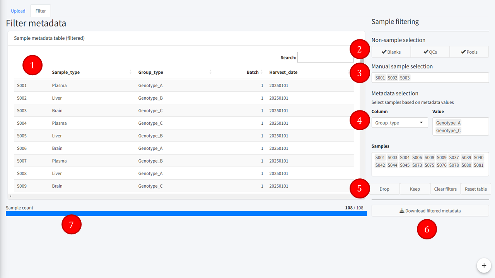

Metadata filter tab
=======================
---

Metadata filtering consists in selecting rows, either manually or based on their metadata, and then either droping or keeping the selection in the table.

1. **Filtering preview**
Preview of the *Filtered metadata table* produced once the filters are applied.  
2. **Non-sample selection**
Easy selection of blank, QCs and pool samples.  
3. **Manual sample selection**
Select individually samples based on their ID.  
4. **Metadata selection**
Select samples based on a metadata value. This has three fields: Column, Value and Samples. In Column is chosen one of the columns from the uploaded metadata table. The list of unique values in the selected column is displayed in the Values field. The user can choose one or more of these values, and the samples matching these values will be displayed in the Samples field. User can interact with the select samples by remove indiviual IDs from the selection.  
5. **Filtering buttons**  
Drop button: remove the selection from the table.  
Keep button: remove all samples aside from the selection.  
Clear button: clears the current selections.  
Reset button: reset the table to the original imported table.  
6. **Download filtered metadata**  
Downloads the filtered table as CSV.  
7. **Sample count**  
Displays the number of samples left after filtering.  

