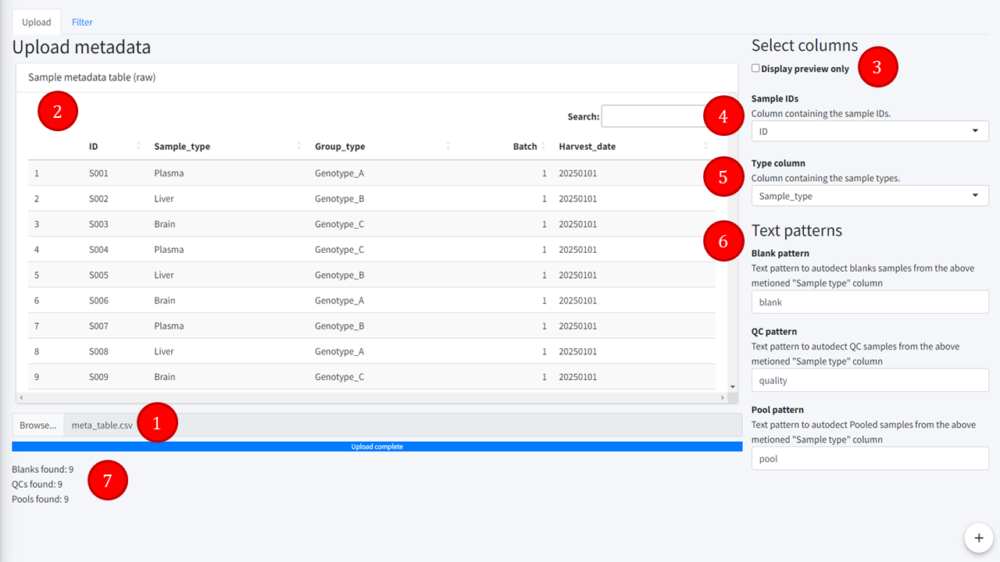

Metadata upload tab
=======================
---

Tab to upload the sample metadata and identify some key columns and rows.  

1. **Upload module**  
Search the file to be uploaded, which must be CSV and formatted as displayed in the *Table format* help tab.  
2. **Uploaded table**  
Preview or the full table uploaded.  
3. **Preview table**  
Whether the imported table should be displayed entirely or only a preview. By default for metadata, the full table is displayed as the data usually remains small.  
4. **Sample IDs**  
Select the ID column of the metadata table, shared between all uploaded tables. Must be unique, string or integer.  
5. **Type column**  
Select the sample type column, in which texts patterns will be searched to find and differentiate between samples, blanks, QCs and pool samples.  
6. **Text patterns**
Input texts to be used for text recognition to find blank, qc and pool samples.  
7. **Types feedback**
Feedback on the number of blanks, QCs and pool samples found using the above mentioned text patterns.  

