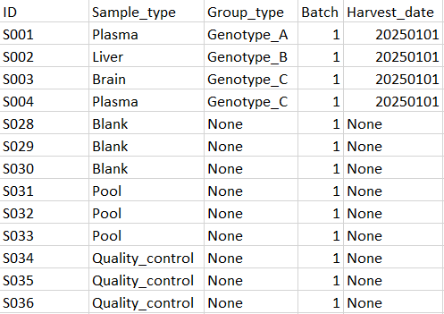
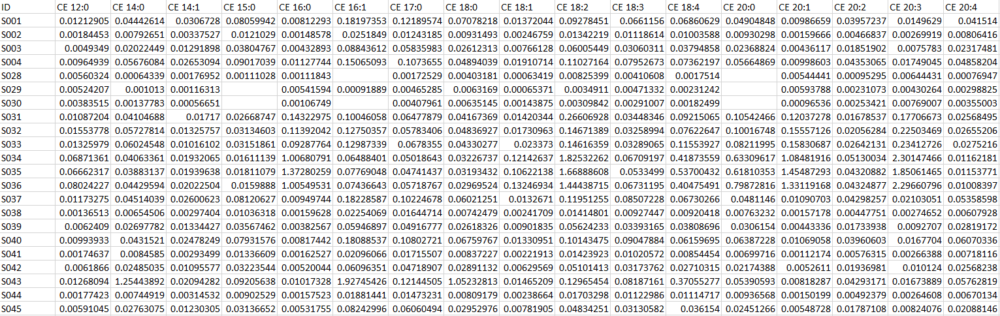

Formatting your data prior to upload
=======================
---
SODA currently accepts the following data formats: CSV, CSV2 and TSV (or TXT: tab separated).  
Files to upload include:
* Sample metadata
* Lipidomics data

All these tables should contain a shared ID column with which samples can be connected between tables. The data type of ID can be integer or string, as long as the IDs are unique an can be used to communicate between tables (i.e. having the IDs being the same from one table to the other).

## Sample metadata
It should not contain any NA values. Typically recommended columns include:  
- *ID*, column containing the unique identifier for each row, tying the sample metadata to the rows in the other data tables.  
- *Sample_type*, i.e. whether row is an actual sample, a QC, a blank or a pool sample. The type of each sample should also be specified here, like the cell type for example.  
- *Group_type*, i.e. the main groups in the data the user wants to compare. Typically this is genotype.  
- *Sample_name* if the user wants to keep their own sample names somewhere.  
- *Batch* in case of multiple batches being analysed.  
- *Harvest_date*, with the date formatted yyyymmdd.  
- *Cell_type*, redundant with *Sample_type* which should be the column containing the cell type.  
- ... any other data that might be of use.  

Among these, only the ID, sample type and group type columns is mandatory. There are no naming imperatives aside from avoiding spaces and special characters.  

Below is an example, and a more complete table is provided in the package directory: ./test_data/meta_table.csv.  

  
## Lipidomics data
Imported lipidomics table. This contains the concentration of each lipid compound / species detected in each sample (not normalised). The molecule names are formatted in a specific way so as to extract their lipid class, carbon and unsaturation counts easily. This table can contain NA values. The only mandatory column is a form of *ID* column containing sample IDs.  
Below is an example, and a more complete table is provided in the package directory: ./test_data/lips_table.csv.  

