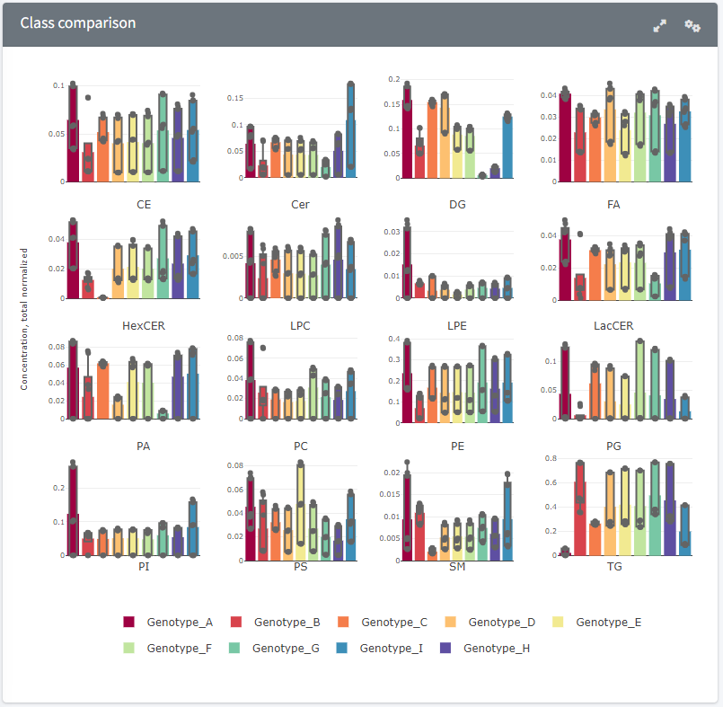
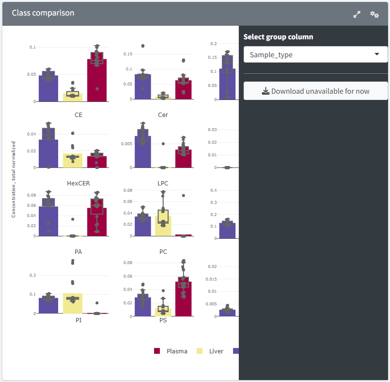

Class comparison
=======================
---
<h3 style="color:gray">Class plot</h3>.  
Plot representing the mean class-level concentrations for each group in a barchart, over which box plots display the quartiles and the medians. The groups can be selected through the sidebar with "Select group column" (a column from the metadata table containing the groups to be compared).  
The concentrations are obtained from the *Total normalised class table*, meaning that the concentrations of each lipid species are normalised to the total lipid concentration in the sample. The class concentrations are then obtained by summing the concentrations of all species from each class.  
The class concentrations for each group are calculated by averaging class concentration of their constitutive samples.  

