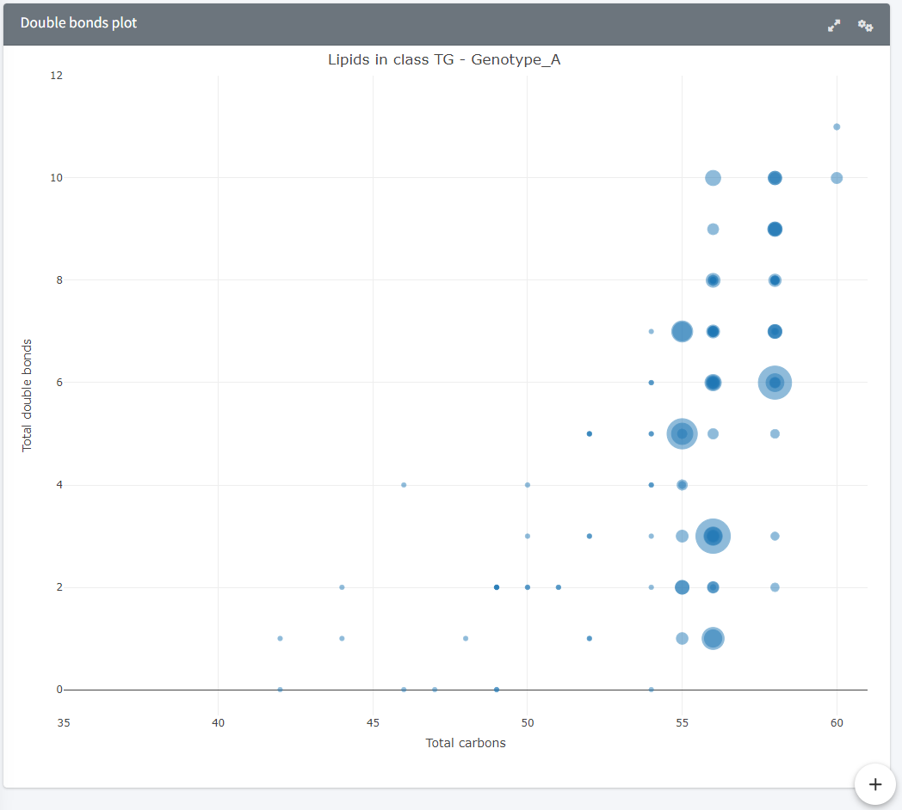
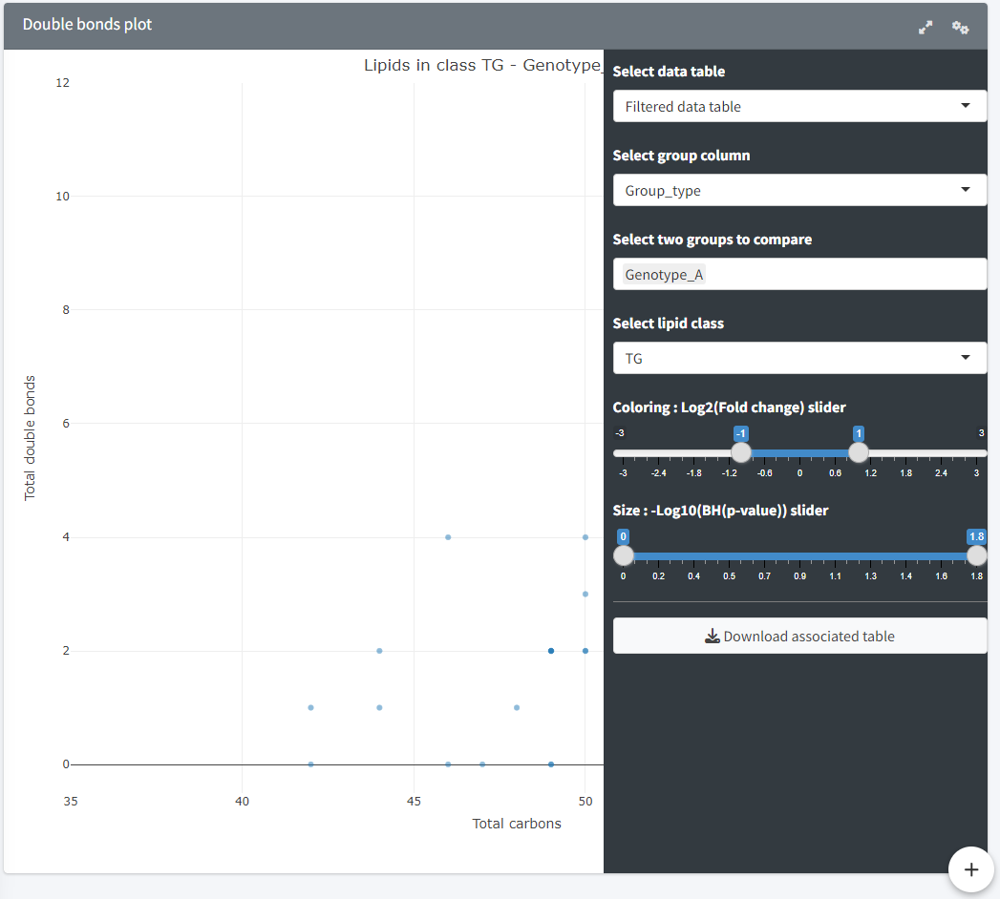
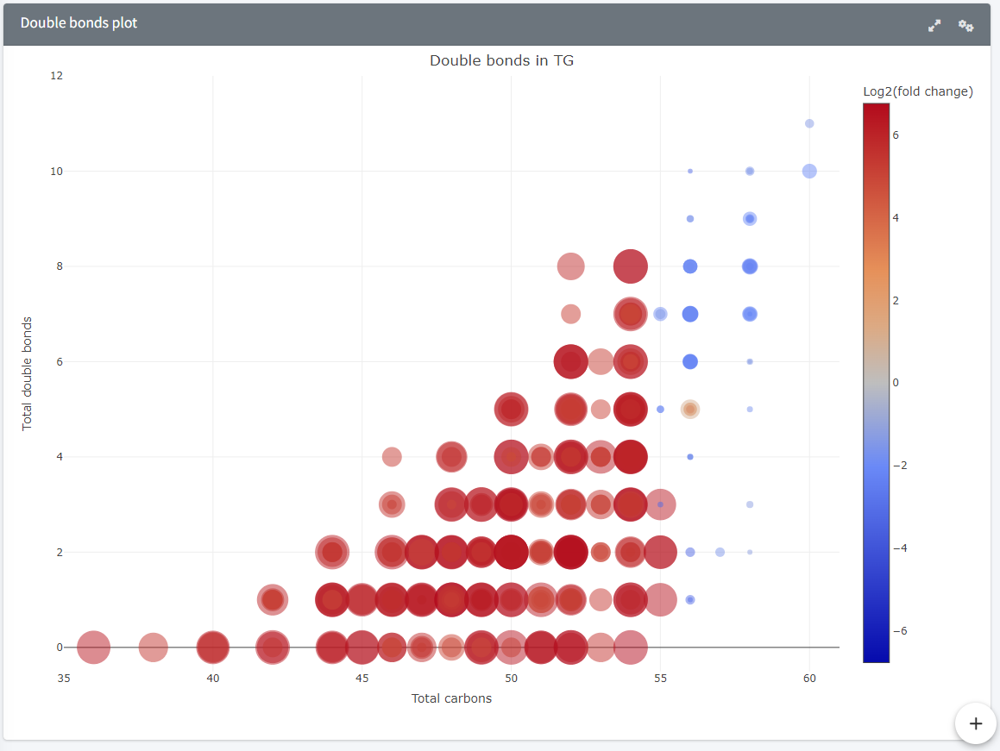
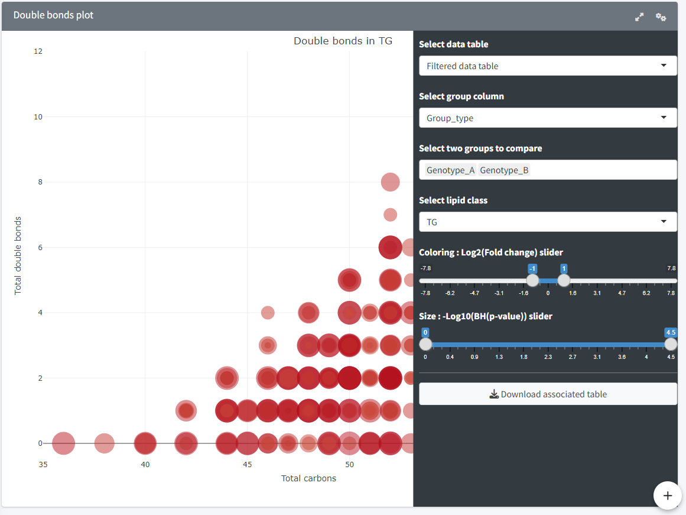

Double bond plot
=======================
---
<h3 style="color:gray">Species plot</h3>.  

<b> Plot and interface </b>

Plot comparing samples based on their lipid species.  
1. **Select data table.**  
Select the data to be used for comparison among the following: *Filtered data table*, *Class normalised data table*, *Total normalised data table*
2. **Select group column.**  
Select a column from the metadata table containing the groups to compare.  
3. **Select group(s).**  
Select one or multiple groups to compare.  
4. **Select lipid class.**  
Select the lipid class to visualise the comparison.  
5. **Select function.**  
Select the way the average value from each group should be calculated, either median or mean (median by default, recommended).  
6. **Coloring slider.**  
Slider displaying a range of Log2(Fold change) values. Values inside the range will be excluded. Generally a -1 to +1 range is used.  
7. **Size slider.**  
Slider displaying a range of -Log10(BH(p-value)) values. Valudes inside the range will be kept.  
8. **Download button.**  
Downloads to CSV the *Double bonds table*.  

This representation has three versions depending on the number of groups selected: one, two, or more.  

**Single group:**  
Simple representation of the lipids from the selected class in that group. The size of the markers is relative to the median value for that lipid in the group. Sliders are deactivated in this version.  

**Two groups:**  
Comparison of the species composition between the two groups by highlighting the fold change and p-values on the double bonds and carbon counts. The markers, representing individual lipid species, are coloured according to Log2(Fold change) in blue and red. This means markers coloured in red (>0) are detected in higher quantities in the second group, and markers coloured in blue (<0) are detected in higher quantities in the first group. Their size is relative to -Log10(BH(p-value)) meaning that the bigger the marker, the more significant that lipid is (low p-value).  
Sliders allow a better exploration of the data, especially when markers are stacked. Hovering on the marker displays the associated values: Log2(Fold change) and -Log10(BH(p-value)).  

**More groups:**  
*Available in upcoming updates*.  
Compares all groups to a reference group using the same methods as in the Two groups version (fold change and p-value).  

<b> Data processing </b>

**Tables used:** {*Filtered data table*, *Class normalised data table*, *Total normalised data table*}, *Filtered feature table*.  
Samples of the two groups are selected and for each feature in the *Filtered feature table*, p-values and fold changes are calculated using one of the selected tables. Features absent from both groups are removed prior to processing.  
  
The fold change is calculated from the selected data table (one of *Filtered data table*, *Class normalised data table*, *Total normalised data table*) using the median value of the second group divided by the median value of the first group, ignoring missing values. In case of groups containing only missing values: 
- First group contains only NAs (denominator), the fold change is set to slightly above the maximum fold change, i.e. 1.01 x max fold change (high value divided by low value).  
- Second group contains only NAs (numerator), the fold change is set to slighlty below the minimum fold change, i.e. 0.99 x min fold change (low value divided by high value).  
  
In the case of medians being 0:  
- Denominator median is 0, fold change becomes Inf. Inf is set to slightly above the maximum fold change, i.e. 1.01 x max fold change (high value divided by low value).  
- Nominator median is 0, fold change becomes 0. 0s are replaced to a value slighlty below the minimum fold change, i.e. 0.99 x min fold change (low value divided by high value).  
- Both nominator and denominator are 0, fold change becomes NA. These are set to 1.  

The p-value is calculated using a Wilcoxon test on the z-scored table (one of *Filtered data table*, *Class normalised data table*, *Total normalised data table*) between group 1 and group 2 for a given feature. In case of groups containing only NAs:  
- One group contains only NAs, the p-value is set to slightly below the minimum p-value, i.e. 0.99 x min p-value (low values compared to high values).  

The p-value is then adjusted using the Benjamini-Hochberg procedure.  

The *Double bonds table* is then produced from the *Filtered feature table* (containing feature metadata) and adding log2(fold change) and -log10(BH(p-value)).    

