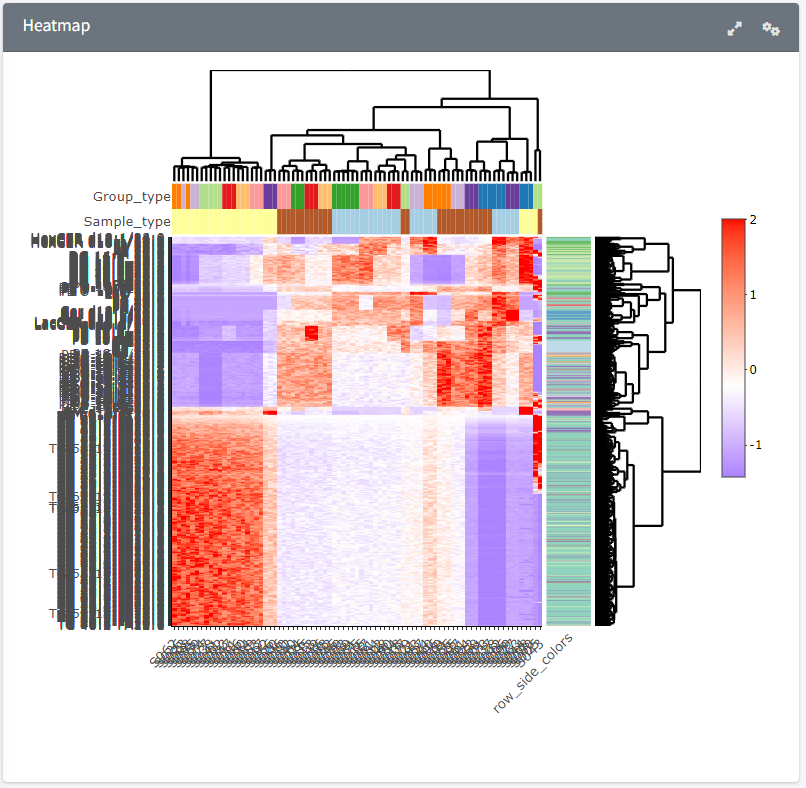
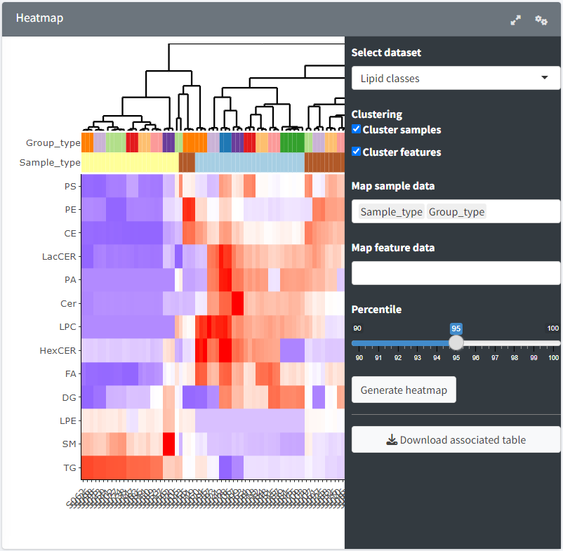

Heatmap
=======================
---

<b> Plot and interface </b>

Plot to visualise correlations between samples and features. Two datasets can be selected from the sidebar, either lipid species (individual compounds) or lipid classes. Samples and features can be left in their original order, or clustered by ticking either one or both "Cluster samples" and "Cluster features" boxes.  
Metadata can be mapped on the heatmap x- and y-axes to observe more correlations. "Map sample data" allows a selection of one or more metadata columns to be mapped on the sample axis. "Map feature data" allows a selection of one or more columns from the *Filtered feature table*, i.e. lipid class, carbon count or unsaturation count.  
The "Percentile" slider allows a filtering of the data from the 90th to the 100th percentile to prevent outliers from disrupting the heatmap colouring. Choosing the 95th percentile means that 95% of the data will be displayed, i.e. the top 2.5% and bottom 2.5% will be excluded from the colour scale.  
The heatmap is generated once the "Generated heatmap" button is clicked (can take some time).  
The individual values can be examined by hovering the mouse over each cell, however the outlier values are capped to the minimum and maximum values of the percentile chosen. All the values (including the outlier actual values) can be obtained from the download table button.  

<b> Data processing </b>

Two tables can be selected, *Total normalised and z-score data table* or *Total normalised and z-scored class table*, respectively the normalised lipid species or lipid classes.  
Using the percentile slider, the maximum and minimum values of the colour coding are set from the selected table. The midpoint is set to the median of all the values. The values are then displayed directly on the heatmap.  

