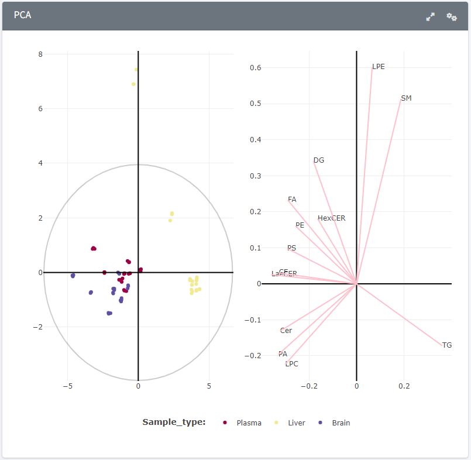

PCA
=======================
---
<h3 style="color:gray">Z-scored class plot, Z-scored species plot</h3>.  

<b> Plot and interface </b>

Plot to observe correlations between sample groups. Two datasets can be selected from the sidebar, either lipid species (individual compounds) or lipid classes. Data points in the scores plot can be coloured by groups using the "Select metadata column" selector. The loadings plot displays which variables cause the observed clustering. Both scores and loadings tables can be downloaded via their respective download buttons.  

<b> Data processing </b>

Two tables can be selected, *Z-scored total normalised data table* or *Z-scored total normalised class table*, respectively the normalised lipid species or lipid classes. Loadings and scores are calculated for PC1 and PC2, and the data is displayed in the form of scatter plots.  

