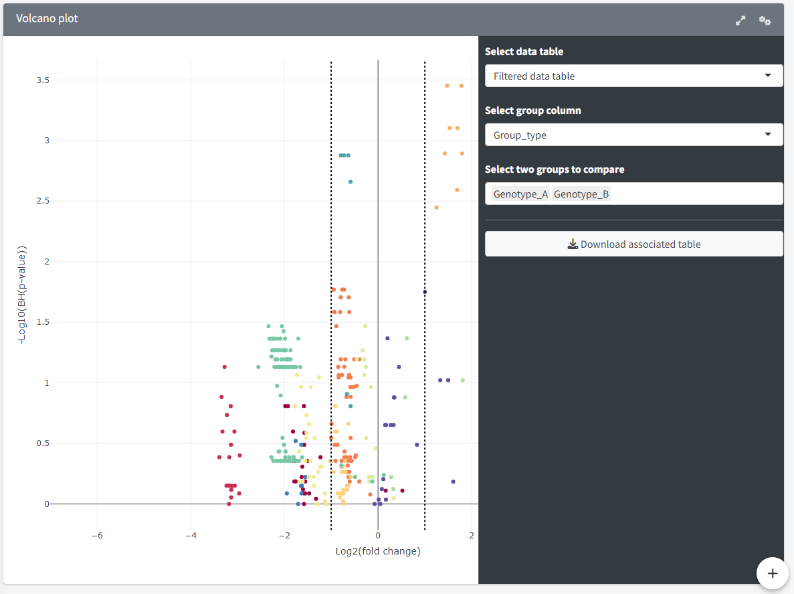

Volcano plot
=======================
---

Plot used to visualise the differences between two sample groups by plotting the -log10(BH adjusted p-value) against the log2(fold change). The groups can be selected through the sidebar with "Select group column" (a column from the metadata table containing the groups to be compared). The comparison is done on a one-on-one basis, so two groups must be selected in the "Select groups to compare" slot.  
The data table produced for the volcano plot can be downloaded using the download button.  
The datapoints, representing the individual lipid species, are coloured according to their lipid class to easily 

