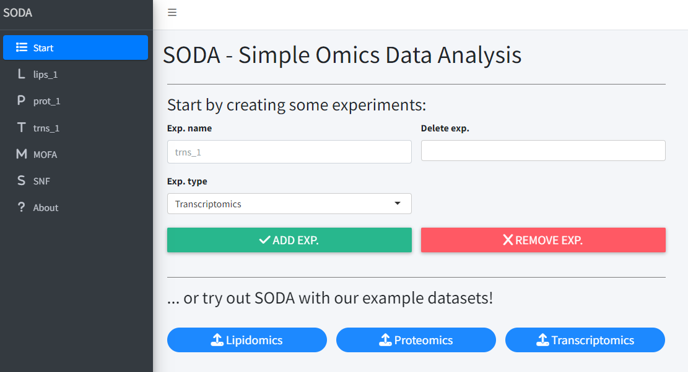

## Start Module

The Start Module serves as the central hub for managing your experiment modules. From here, modules can be named, created, deleted, and example datasets can be loaded.

### 1. Creating a Module:
- **Experiment Name (Optional)**: For assigning a name to experiments. Only alphanumeric characters and underscores are allowed. If left blank, the system will auto-generate a name based on the experiment type, followed by an incremental number to avoid naming conflicts (e.g., lips_1, lips_2, prot_1, prot_2, and so forth).
- **Experiment Type**: For specifying the type of omics for the experiment. The available options are: 
  - Lipidomics
  - Proteomics
  - Transcriptomics
- **Add Exp. Button**: After selecting the experiment type, this button will create the module. Once created, the module will be accessible via the sidebar menu.

### 2. Removing a Module:
- **Delete Exp.**: Choose the experiments to be deleted from the list.
- **Remove Exp. Button**: Click to delete the selected experiments. Note: This is temporarily disabled.

### 3. Using Example Data:
- Pre-configured example datasets for Lipidomics, Proteomics, and Transcriptomics are available for convenience. By selecting any of these datasets, the system will automatically create the corresponding modules, making them immediately accessible through the sidebar.

